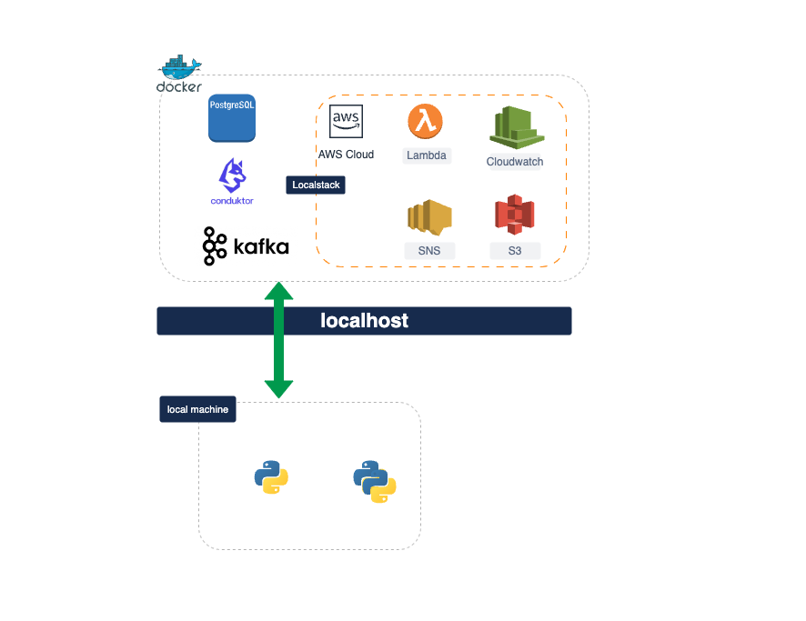
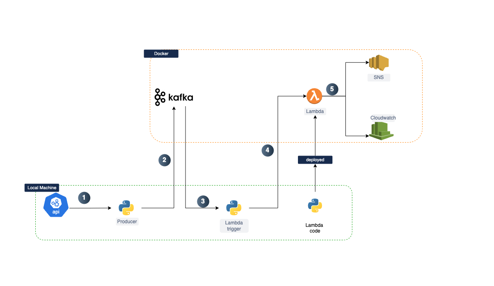

# Real-time Flight Data Processing with OpenSky Network

## Problem Statement

The goal of this project is to build a real-time data processing pipeline that ingests flight data from the OpenSky Network API, processes it using AWS Lambda, and receive in SNS. 
This project will demonstrate the ability to handle real-time streaming data, perform data transformations, and integrate cloud services seamlessly.

### Infrastructure
All the infrastructure needed to run the application end to end is given docker services so that we can run the services locally end to end. 
The list of services made available  along with brief introduction and credentials to access it are given below.

| Service        | Image                                 | Description                                                                                                                                                                 | Access                                                                            | Volumes                                                                                                  |
|----------------|---------------------------------------|-----------------------------------------------------------------------------------------------------------------------------------------------------------------------------|-----------------------------------------------------------------------------------|----------------------------------------------------------------------------------------------------------|
| **Zookeeper**  | `confluentinc/cp-zookeeper:7.5.0`     | **Apache Zookeeper**: A coordination service that manages and syncs distributed systems. Essential for Kafka to keep track of its distributed brokers and configuration.    | `localhost:2181`                                                                  | None                                                                                                     |
| **Kafka**      | `confluentinc/cp-kafka:7.5.0`         | **Apache Kafka**: A distributed messaging system for streaming data. It allows you to publish and subscribe to real-time data feeds. Kafka uses Zookeeper for coordination. | `localhost:9092`                                                                  | None                                                                                                     |
| **LocalStack** | `localstack/localstack:latest`        | **LocalStack**: A local simulation of AWS cloud services. It allows you to develop and test applications against a local version of AWS services.                           | `localhost:4566` (S3, SNS, Lambda, SQS, CloudWatch are enabled)                   | `${LOCALSTACK_DOCKER_VOLUME:-./volume}:/var/lib/localstack`, `/var/run/docker.sock:/var/run/docker.sock` |
| **Postgres**   | `postgres:14`                         | **PostgreSQL**: A powerful open-source relational database system. Used for storing structured data.                                                                        | `localhost:5432` (Database: `conduktor`, User: `conduktor`, Password: `password`) | `postgres_data:/var/lib/postgresql/data`                                                                 |
| **Conduktor**  | `conduktor/conduktor-platform:latest` | **Conduktor**: A management and monitoring tool for Kafka. Provides a user interface to manage Kafka topics, brokers, and more.                                             | `localhost:8080` (Login: `admin@admin.io` / `admin`)                              | `conduktor_data:/data`                                                                                   |




## Detailed Requirements

### 1. Data Ingestion

- **Source**: Use the OpenSky Network API to fetch real-time flight data.
- **Frequency**: Fetch data every 3 seconds.
- **Kafka Producer**: Implement a Kafka producer to stream the fetched flight data into a Kafka topic named `aviation-data`.

### 2. Data Processing

- **AWS Lambda**: Set up an AWS Lambda function that acts as a consumer for the Kafka topic.
- **Data Transformations**:
  - **Filter**: Only include flights that are currently in the air (i.e., altitude > 0).
  - **Select Fields**: Extract and transform specific fields from the flight data.
- **Output Format**: Convert the data into a JSON format with the selected fields.

### 3. Notification System

- **SNS Topic**: Create a single SNS topic named `FlightNotifications`.
- **AWS Lambda to SNS**: After processing, the Lambda function should publish the transformed data to the `FlightNotifications` SNS topic with `origin_country` as a message attribute.

## Expected Output

### 1. Kafka Topic (`aviation-data`)

- Raw flight data streamed from the OpenSky Network API every minute.

### 2. Processed Data

- A JSON message with the following structure:
  ```json
  {
    "icao24": "abcd1234",
    "callsign": "XYZ123",
    "origin_country": "CountryName",
    "time_position": "2024-08-01T12:34:56Z",
    "longitude": 12.3456,
    "latitude": 78.9101,
    "altitude_feet": 30000,
    "velocity_knots": 450
  }
  ```

### 3. SNS Notification

- Notifications containing the processed flight data in JSON format sent to all subscribers.

## Example Scenario

1. **Ingestion**:
   - Every N seconds, the Kafka producer fetches the latest flight data from the OpenSky Network API and publishes it to the `aviation-data` Kafka topic.

2. **Processing**:
   - The AWS Lambda function is triggered by new messages in the Kafka topic. It processes each message, filtering out flights that are not currently in the air and transforming the data into the desired JSON format.

3. **Notification**:
   - The processed data is published to the `FlightNotifications` SNS topic.

By completing this challenge, you will demonstrate your ability to integrate real-time data ingestion, processing, and notification systems using Kafka, AWS Lambda, and AWS SNS.

# Project Setup

### Python

- Install Python3.10
- Install Virtual-env
- Install project dependencies

    ```shell
    pip install -r src/requirements.txt
    ```

### Docker

This project depends on Docker engine being installed in your local machine. But to make installation easier, 
Makefile targets have been given by default for Windows, Linux & MacOS. 


To ensure Docker engine is installed, simply execute the following command

```shell
$ make setup
```
 

## How to run the project ?

#### Infra & Application flow 
- All the infrastructure will be made available to us via **Docker**
- All the services like Postgres, Conducktor, Kafka, Zookeeper & Localstack will me made available via `Localhost` under different ports.
- The Python applications we will be using for this projects `will be running in your local machine`.
- It's important to understand that the Python applications we will be using for this projects **WILL NOT BE RUNNING INSIDE DOCKER**, so its important to have working python environment

#### Development Flow
This will pretty much be the flow of how we will be doing our development

- **Step-1:** Start all the services via Docker
- **Step-2:** Develop Producer locally & run it locally. 
- **Step-3:** Develop Lambda trigger locally & run it locally.
- **Step-4:** Develop aws Lambda code locally, test it locally, Deploy it to AWS(localstack), and run the lambda within AWS environment.

In Summary, 
`Fetch API data (local) -> Produce to Kafka (local) -> For every message trigger Lambda using boto3 (local) -> Process the message using Lambda (aws/localstack) -> Publish the message  to SNS topic (aws/localstack)`



#### Deploying into AWS/Localstack
Deployments are made really easy via make targets

```shell
$ make deploy-lambda
```

- will deploy the latest code you have in `src/part-3/event_processor.py` deployed into localstack.
- The lambdas are **NOT PERSISTENT across runs**, meaning, everytime you restart the services you need to deploy the latest code again.
- This mode of persistence is intentional, so that we don't have to worry about deleting pre-existing lambdas
- If you are trying to run the command twice within the same run, the latest command will fail because lambda will already exist, simply restart the service using `make restart`


## Useful Make targets


### Start all services
```shell
make run
```

### Stop all services
```shell
make stop
```

### Restart all services
```shell
make restart
```


### Deploy lambda into AWS/Localstack
```shell
make deploy-lambda
```

### Create SNS topic in AWS/Localstack
```shell
make create-sns-topic
```
### Deploy Lambda & SNS in one go
```shell
make deploy-resources
```

### Deploy Lambda & SNS in one go
```shell
make deploy-resources
```

### Count number of messages in SNS topic
```shell
make count-messages  # will default the time period as 1min for cloudwatch metric
make count-messages mins=5 # will set the time period  for metric as 5 mins
```
We will be using all these commands while we are implementing different part of the exercises.

# Project Components
This hands on Session will be split into 3 Major parts, focusing purely in python side of things  while providing everything else you need to make your python application work end to end.

- **Part 1:** Will focus on getting the data from the API and publishing it to Kafka.
- **Part 2:** Will focus on Writing the Lamda logic locally and deploying to cloud (localstack).
- **Part 3:** Will focus on creating a pipeline that reads kafka messages and triggers lambda to process each message.